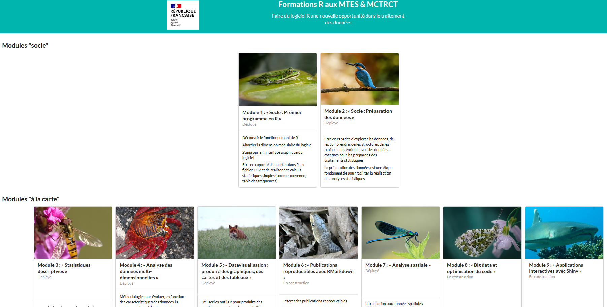

```{r setup, include=FALSE}
options(htmltools.dir.version = FALSE)
```


# Enjeu

## Pourquoi ne pas se contenter des documentations existantes ?


**1. Cibler les ressources pertinentes**

- Eclatement de la documentation des écosystèmes `R` et `Python` ; <br>
- Barrière linguistique : la grande majorité de la documentation est en anglais ; <br>
- Niveaux hétérogènes
<br><br>

--

**2. Bénéficier de l'expérience d'utilisateurs** :

- Diversité des cas d'usage de `R` ou `Python` dans le service public ; <br>
- Multiplicité de *packages*, de qualité variable et parfois redondants ; <br>
- Utiliser un langage pour un projet statistique n'implique pas les mêmes pratiques
que pour un projet d'application

---
# Panorama incomplet des ressources disponibles (1/2)


**1. Modules d'autoformation sur [sspcloud.fr/documentation](https://www.sspcloud.fr/documentation);**

+ Notebooks pédagogiques, différents niveaux accessibles
+ Environnements normalisés: pas de problèmes d'installation de *packages*
+ Formation aux bonnes pratiques: modularité, contrôle de version, stockage séparé du code
+ `Funcamp` pour découvrir sous forme ludique `R` (avec des missions à la `Zelda`)
<br><br>

--

**2. Ressources `Python` `r fontawesome::fa("fab fa-python")` (et `Git` `r fontawesome::fa("fab fa-git-alt")`):**

+ Formations datascientest proposées par Spyrales ;
+ Initiation à Python sur [sspcloud.fr/documentation](https://www.sspcloud.fr/documentation) ;
+ Perfectionnement avec le cours de [2A ENSAE "Python pour data scientists et économistes"](https://linogaliana-teaching.netlify.app/) [`r emo::ji("zoom")`](#python)
    
---
# Panorama incomplet des ressources disponibles (1/2)

**3. Ressources `R` (et `Git` `r fontawesome::fa("fab fa-git-alt")`):**

+ [Portail MTES](https://mtes-mct.github.io/parcours-r/) [`r emo::ji("zoom")`](#r) ;
+ Formations sur des points plus spécifiques. ex: [Travail collaboratif avec R](https://linogaliana.gitlab.io/collaboratif/)
+ Et bien d'autres formations de qualité (certaines référencées par [spyrales.fr](https://www.spyrales.fr/))


--
# Panorama incomplet des ressources disponibles (2/2)

**4. La documentation collaborative et open-source [`utilitR`](https://www.utilitr.org/) [`r emo::ji("zoom")`](#utilitr)**:

+ Née à l'Insee, le public visé est plus large (tout utilisateur de données avec `R`) ;
+ Couvrir des cas d'usage courants des utilisateurs de données ;
+ A venir un guide des bonnes pratiques `R` et `Python` orienté projet de données ;
+ Déjà plus de 25 contributeurs, rejoignez-nous !


---
name: python
# Ressources `r fontawesome::fa("fab fa-python", fill = "white")`: cours de l'ENSAE

[https://linogaliana-teaching.netlify.app/](https://linogaliana-teaching.netlify.app/)
([dépôt `r fontawesome::fa("fab fa-github")`](https://github.com/linogaliana/python-datascientist))
<br><br> 

**Un cours complet pour la _data-science_** :

+ Manipulation et structuration de données ;
+ Visualisation ;
+ Modélisation (économétrie et _machine learning_) ;
+ Données textuelles (NLP) ;
+ Git `r fontawesome::fa("fab fa-git-alt")` et Github `r fontawesome::fa("fab fa-github")`.


```{r, echo = FALSE, out.width = "40%", fig.align = "center"}
knitr::include_graphics("https://linogaliana-teaching.netlify.app/home/word_hu0f2ad2f0666a655e142df16fc7085a46_395838_1200x0_resize_lanczos_2.png")
```


---
# Ressources `r fontawesome::fa("fab fa-python", fill = "white")`: cours de l'ENSAE

[https://linogaliana-teaching.netlify.app/](https://linogaliana-teaching.netlify.app/)
([dépôt `r fontawesome::fa("fab fa-github")`](https://github.com/linogaliana/python-datascientist))
<br><br> 

**Introduire à la philosophie de la data-science** :

+ Reproductibilité et pérennité des projets
+ Versioning et partage des codes
+ Réduction des coûts de mise en prod
<br><br>

--

**Mise à disposition tutoriels et exercices facilitée**:

```{r, echo = FALSE}
knitr::include_graphics("badges.png")
```

[Page en question: https://linogaliana-teaching.netlify.app/webscraping/](https://linogaliana-teaching.netlify.app/webscraping/)

---
name: utilitr
# Ressources `r fontawesome::fa("fab fa-r-project", fill = "white")`: `utilitR`

[https://www.utilitr.org/](https://www.utilitr.org/)
([dépôt `r fontawesome::fa("fab fa-github")`](https://github.com/InseeFrLab/utilitR))
<br><br> 

** 1. Un positionnement différent par rapport à une formation**:

+ Approche par les cas d'usage ;
+ Recommandations et conseils issus de débats sur [Github](https://github.com/InseeFrLab/utilitR) ;
+ Point d'entrée avec de nombreuses références;
<br><br>

** 2. Une documentation complète pour statisticiens/_data-scientists_ **;

+ Tout est disponible sur [https://www.utilitr.org](https://www.utilitr.org)
+ Bientôt un guide des bonnes pratiques
+ Aussi des éléments sur `Git`.

<br>
**Rejoignez l'équipe des contributeurs ! **

```{r, echo = FALSE, out.width="15%", fig.align = 'right'}
knitr::include_graphics("https://raw.githubusercontent.com/InseeFrLab/utilitR/master/resources/logo-utilitr.png")
```

---
name: r
# Ressources `r fontawesome::fa("fab fa-r-project", fill = "white")`: le portail MTES

[https://mtes-mct.github.io/parcours-r/](https://mtes-mct.github.io/parcours-r/)
([dépôt `r fontawesome::fa("fab fa-github")`](https://github.com/InseeFrLab/utilitR))
<br><br> 

**Un portail d'(auto)formation avec une grande diversité de modules:**

- Modules introductifs (modules *"socle"*): intro à la programmation, analyse de données
- Modules thématiques (modules *"à la carte"*): datavisualisation, RMarkdown, analyse spatiale...
<br>

```{r, echo = FALSE, fig.align ="center"}

```

---
# Ressources `r fontawesome::fa("fab fa-r-project", fill = "white")`: le portail MTES

[https://mtes-mct.github.io/parcours-r/](https://mtes-mct.github.io/parcours-r/)
([dépôt `r fontawesome::fa("fab fa-github")`](https://github.com/InseeFrLab/utilitR))
<br><br> 

**Retour d'expérience:**

- 120 agents formés en 2021 via le parcours `R` ;
- Une vingtaine de formateurs du `MTE` ; 
- Une petite dizaine d’agents produisent les supports ;
- Des formations dispensées principalement à distance ;
- Et des formations avancées dispensées à quelques agents par un prestataire extérieur.
<br><br>

--

**Une stratégie plus globale:**
- [La feuille de route du pôle ministériel](https://www.ecologie.gouv.fr/feuille-route-donnee-des-algorithmes-et-des-codes-sources)